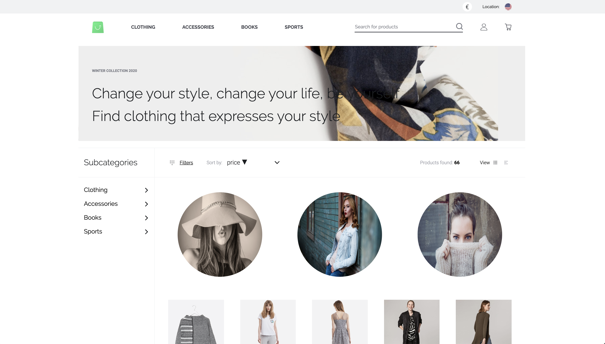

# Getting started

## Quickstart

### Installation

This will install the showpare-pwa CLI tools and make them globally available.

```bash
yarn global add @shopware-pwa/cli
```

or

```bash
npm install -g @shopware-pwa/cli
```

::: details Canary version  
Currently, we're releasing a `canary` version per every push to `master` branch, so in order to have newest changes and fixes just install it like this:

```bash
npm install -g @shopware-pwa/cli@canary
```

:::

### Usage

Create a directory for your project and enter it

```bash
mkdir my-shopware-pwa
cd ./my-shopware-pwa
```

Initialize the project inside the directory by running

```bash
shopware-pwa init
```

It will ask for the address to your shopware instance, access token, and admin credentials to load plugins. Only the first two are required to start the instance, and default settings will point to our demo instance.

::: tip
Don't let this step throw you off. As you are starting the PWA, it requires a backend to get its products, content etc. By default, shopware-pwa init will connect you to a generic Shopware backend hosted by us. However, at this point you can already connect your custom shop instance.

Please read these instructions on [how to prepare your Shopware 6 instance](/landing/getting-started/prepare-shopware) to communicate with the PWA before running shopware-pwa init.
:::

Then you can just begin local development by typing:

```bash
yarn dev
```

After roughly 30 seconds, your application will be available locally on [http://localhost:3000](http://localhost:3000) looking similar to this:



### How do I move on?

How about...

 * Exploring the [directory structure](/contribution/structure) of the project.
 * Learning [the fundamentals](/landing/fundamentals) like the frameworks and libraries we use or patters we follow
 * Looking into [functional concepts](/landing/concepts) of the PWA, like CMS or Payment
 * [Reporting an issue](https://github.com/DivanteLtd/shopware-pwa/issues/new/choose) to our Github repository if you've encountered any

</center>